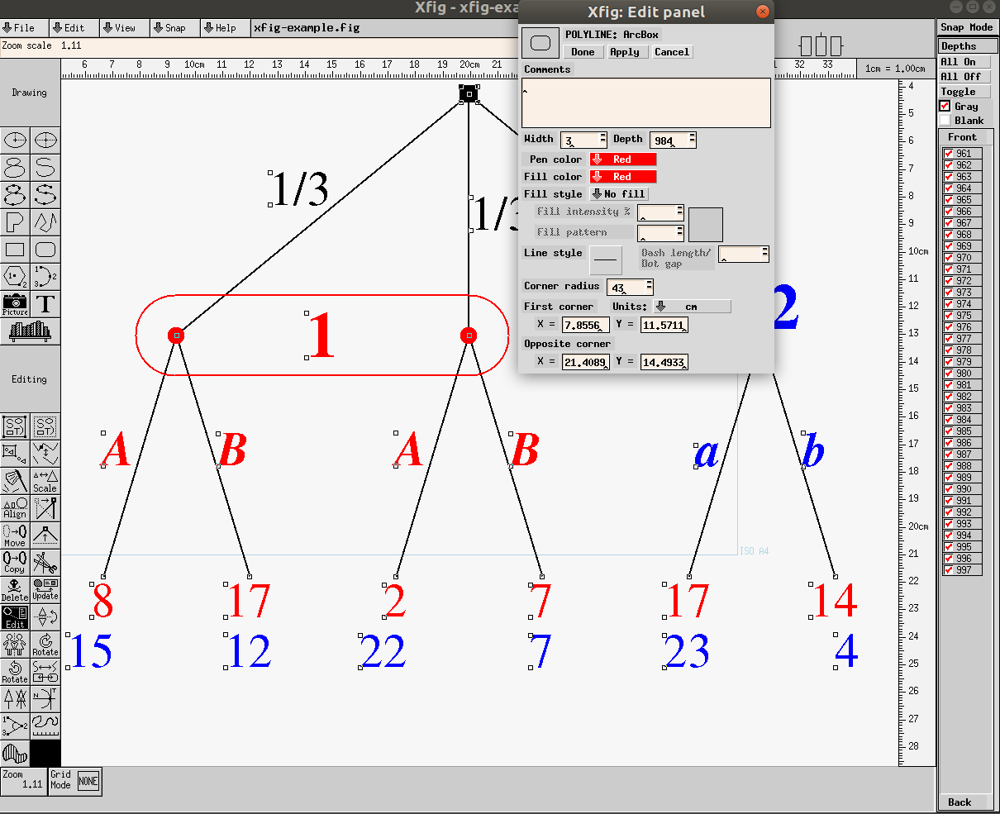
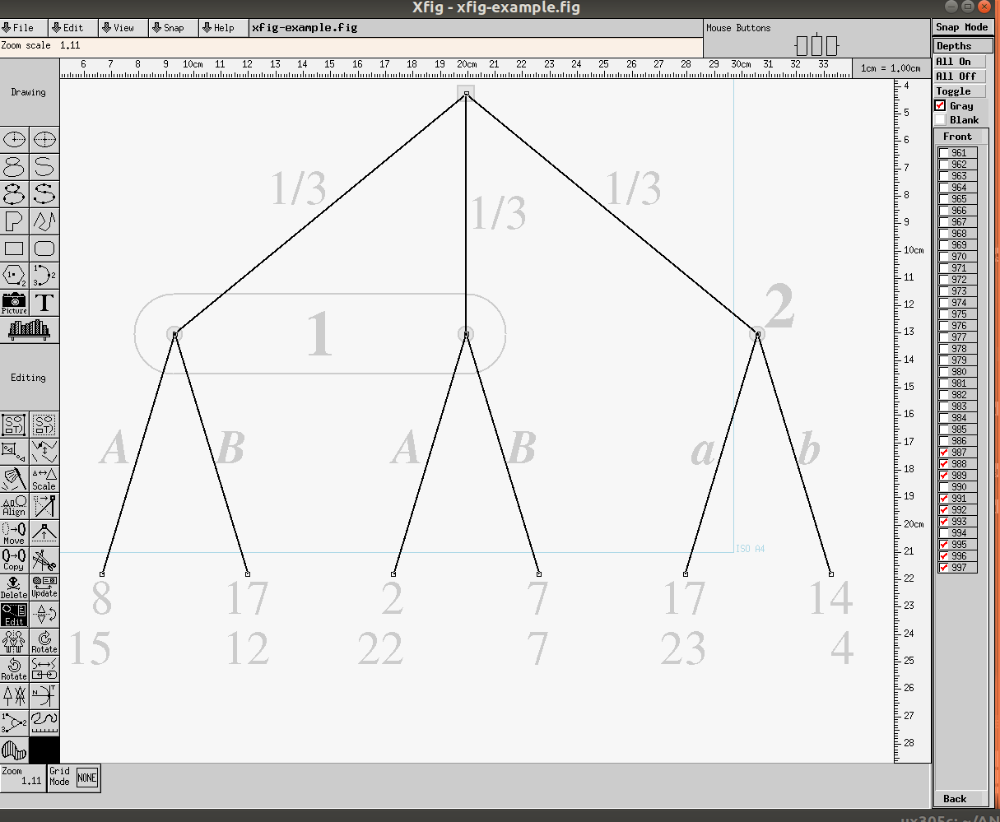
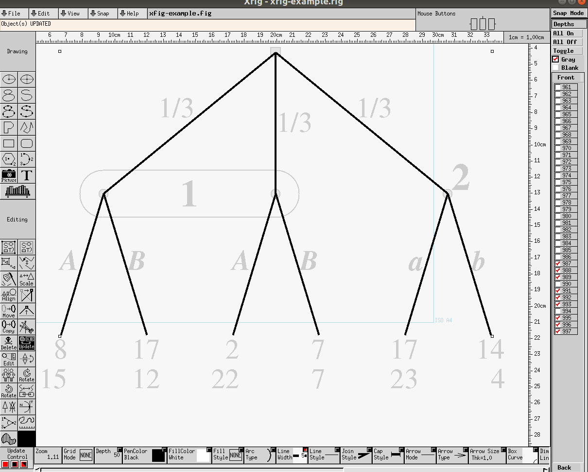

# Exporting gte pictures to xfig

This has high priority because GTE is a nice drawing tool
for game trees and strategic-form games.

The xfig drawing program is an old GUI tool for 2D graphics
common on Linux.
It is mode-based and allows easy post-manipulation that
would be clumsy to implement in GTE itself.

Its text-based .fig format, documented in
[`fig-format-2018`](./fig-format-2018) as 
taken from http://mcj.sourceforge.net/fig-format.html,
is compact, and allows reliable conversions to other formats
such as .pdf or .svg with the `fig2dev` program.
Hence, if exported to .fig, we get the other formats by a
call to `fig2dev` on a Linux backend server without any
extra work.

## The example 

The following example was generated with the old GTE program
(stored in `xfig-example.xml`), here a screenshot:

and exported to xfig into
[`orig-xfig-example.fig`](./orig-xfig-example.fig) 
and then manually post-processed in xfig by deleting the
white canvas background, giving
[`xfig-example.fig`](./xfig-example.fig),
in order to restrict the drawing to the tree alone without
unnecessary white margins.

The difference between these two files
[`orig-xfig-example.fig`](./orig-xfig-example.fig) and
[`xfig-example.fig`](./xfig-example.fig) 
shows that in the second file saved by the xfig program

- only integer coordinates are used, but floating point
  numbers are apparently harmless and either truncated or
  rounded when the file is read in by the xfig drawing
  program;

- the objects are re-sorted by type rather than depth.

Sample exports, directly from xfig, are to `xfig-example.jpg` as here:

to 
[`xfig-example.pdf`](./xfig-example.pdf) , 
and via 

    fig2dev -L svg xfig-example.fig xfig-example.svg

to `xfig-example.svg` as here:

## Current shortcomings of the xfig export

Apart from the unnecessary white canvas background, there
are two main shortcomings of the currently exported .fig
file from GTE:

- text alignment is currently always *left-adjusted*.
  This causes a problem in the following instances:

  * payoffs, which should be *right-adjusted*, are not aligned
    after a font change (used fonts are hard to control)
    as in the file
    [`xfig-example.svg`](xfig-example.svg), which for some
    reason uses smaller font sizes than those used for the
    .pdf file.

  * move labels that are written to the *left* of a line
    should be *right-adjusted* to keep their correct
    position when they are edited

  * the same should apply to player names *left* of a node

  * player names in the middle of an information set should
    be *centered* although they have usually enough space
    around them so this is not a big issue.

- the crucial *depth* information of game tree elements
  (such as nodes, lines, payoffs) is
  currently just a consecutively numbered parameter
  (downwards, starting from 998 and counting down) where
  every element has a unique level. This must be changed, as
  explained in the next section.

- Text of move and player labels is slightly too close to
  the lines / tree nodes.

# Depth information for game tree elements

In xfig, every object has a *depth*.
For example, that depth is typically listed in 7th position
in a graphics object, such as depth 984 in the "ArcBox"
in [`xfig-example.fig`](./xfig-example.fig) 

    2 4 0 3 4 4 984 -1 -1 0.000 0 0 43 0 0 5
        3535 5207 9634 5207 9634 6522 3535 6522 3535 5207

which represents player 1's information set.
If you view the file in xfig (recommended to understand
what's going on), first type `ctrl-Z` to re-center the
figure on the canvas, choose the `Edit` mode on the
left, and click on the information set.
The information that is shown for this object includes
its depth (here 984):

and this picture shows also that all texts are left-aligned.
For a text field as in 

    4 0 1 976 0 3 47 0.0000 4 570 390 14442 8012 b\001

which shows the move label "b", the depth information (here
depth 976) in the 4th position.

The depth field has two purposes:

- objects with lower depth are in the foreground, such as
  game tree nodes, which have the player's colour, are in
  front of the black lines.

- **selecting objects** for changing many of them as the
  same time.
  For example, suppose I want to have the tree edges drawn
  more thickly. In xfig this is done as follows:

  * Select (tickboxes on the right) the required
    tree elements (this is currently very difficult when
    every tree element has its unique depth):

    

  * Group these into a single object, choose the `Update`
    mode, select the new `Line Width`, and apply it to the
    group object:

    

### New depth information to be stored

In order to simplify the latter task (which may also involve
changing player colors, fonts for move labels, etc.), we
want a **separate depth** for each type of game tree element
which has two components: **type of tree element** plus **player
number** p which is a number from 0 to 4.

**Type of element are** (in increasing depth, i.e. earlier
ones are in the foreground), p = player number

- 10 + p game tree *node* (box if chance player)

- 20 + p *information set*

- 30 + p *move label*

- 40 + p *player label*

- 50 + p *payoff*

- 60 + p *tree edge* which is the edge from the parent to
  the node, *where the parent determines* p.
  This is in case someone prefers to paint the tree edges in
  the colour of the player. If this is complicated p=0 for
  black edges are fine.

The numbers 10, 20, etc. should be constants that can be
changed in case they don't come out right.
Nodes and information sets (and move labels if the writing
is too large) should be in front of tree lines but the rest
is typically not overlapping and hence irrelevant.

The point is that this allows quickly, via the depth, to
identify *all* labels of player 1 and 2, for example, which
are meant to get a different font size in xfig. 
I then highlight only depths 41 and 42 and apply this change
in seconds in the xfig GUI.

