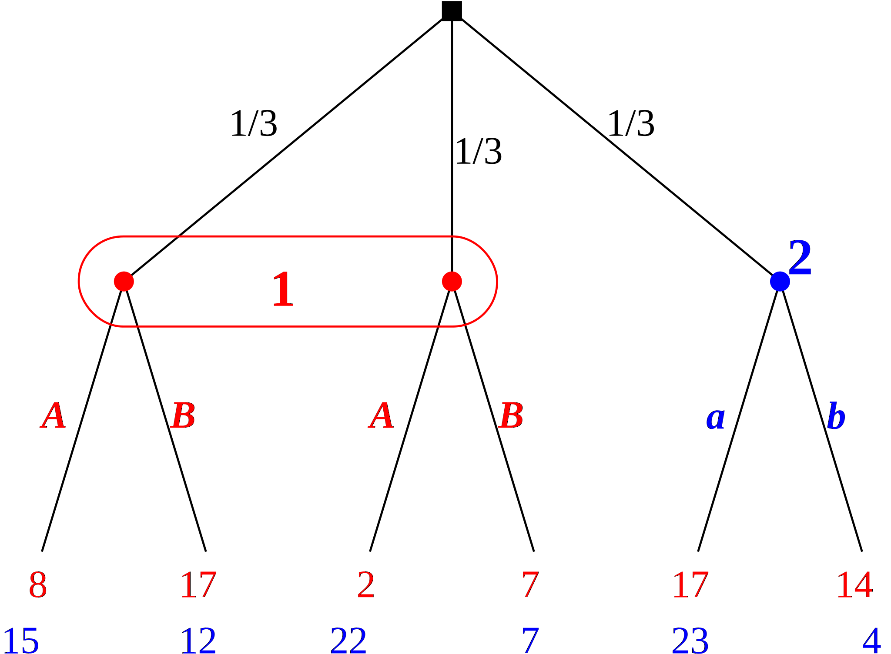

# Exporting gte pictures to xfig

This has high priority because GTE is a nice drawing tool
for game trees and strategic-form games.

The xfig drawing program is an old GUI tool for 2D graphics
common on Linux.
It is mode-based and allows easy post-manipulation that
would be clumsy to implement in GTE itself.

Its text-based .fig format, documented in
[`fig-format-2018`](./fig-format-2018) as 
taken from http://mcj.sourceforge.net/fig-format.html,
is compact, and allows reliable conversions to other formats
such as .pdf or .svg with the `fig2dev` program.
Hence, if exported to .fig, we get the other formats by a
call to `fig2dev` on a Linux backend server without any
extra work.

## The example 

The following example was generated with the old GTE program
(stored in `xfig-example.xml`), here a screenshot:

and exported to xfig into `orig-xfig-example.fig`
and then manually post-processed in xfig by deleting the
white canvas background, giving `xfig-example.fig`, in order
to restrict the drawing to the tree alone without
unnecessary white margins.

The difference between these two files
[`orig-xfig-example.fig`](./orig-xfig-example.fig) and
[`xfig-example.fig`](./xfig-example.fig) 
shows that only integer coordinates are used, but floating
point numbers are apparently harmless and either truncated
or rounded when the file is read in by the xfig drawing
program.

Sample exports, directly from xfig, are to `xfig-example.jpg` as here:

to 
[`xfig-example.pdf`](./xfig-example.pdf) , 
and via 

    fig2dev -L svg xfig-example.fig xfig-example.svg

to `xfig-example.svg` as here:

## Current shortcomings of the xfig export

Apart from the unnecessary white canvas background, there
are two main shortcomings of the currently exported .fig
file from GTE:

- text alignment is currently always *left-adjusted*.
  This causes a problem in the following instances:

  * payoffs, which should be *right-adjusted*, are not aligned
    after a font change (used fonts are hard to control)
    as in the file `xfig-example.svg`.

  * move labels that are written to the *left* of a line
    should be *right-adjusted* to keep their correct
    position when they are edited

  * the same should apply to player names *left* of a node

  * player names in the middle of an information set should
    be *centered* although they have usually enough space
    around them so this is not a big issue.

- the crucial *depth* information of game tree elements
  (such as nodes, lines, payoffs) is
  currently just a consecutively numbered parameter where
  every element has a unique level. This must be changed, as
  explained in the next section.

