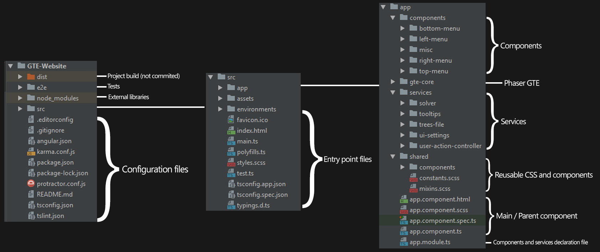
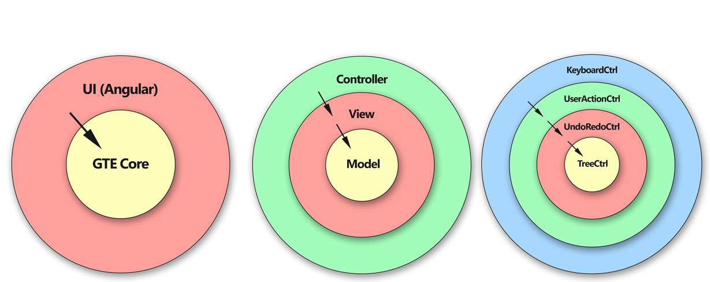

# DOCUMENTATION 

This page should be viewed as a guidance for developers who wish to
contribute to the project. It includes information regarding the
architecture, overall structure, incorporated frameworks and libraries.

## INTRODUCTION

The first stable version of GTE was written in Flash. Due to the
constantly changing web requirements, it has been rewritten as part of a
dissertation project using modern HTML5 technologies, namely with
[Typescript](https://www.typescriptlang.org/) and
[Phaser](https://phaser.io/) - a 2D web-based game engine.

Phaser provides great functionality for writing the core of the software
with ease - built-in canvas for drawing, input management, animations,
signals and much more. The user interface, i.e. buttons, dialogs,
windows are written separately. In the dissertation, the UI was written
with [jQuery](https://jquery.com/). As the UI started to
evolve it became clear that a more sophisticated framework had to
replace jQuery, in this case, the developers chose
[Angular](https://angular.io/).

Phaser GTE is incorporated into Angular as a plugin. Should the
developers wish to rewrite or switch to another UI framework like
[React](https://reactjs.org/),
[Vue](https://vuejs.org/) or any other, they can extract
the existing core and place it into their own project with only slight
modifications.

The current version of Phaser in the project is 2.11.0 CE (community
edition). Version 3 of the game engine is available, but due to a
missing core feature (namely, applying tints to sprites in Canvas), GTE
currently uses Phaser 2.x, which will be updated by the community in the
future.

In the dissertation, the Phaser core of the software was initially
written with the [MVC design
pattern](https://en.wikipedia.org/wiki/Model%E2%80%93view%E2%80%93controller).
In the newer version, slight modifications were made and now the project
strictly follows the [CLEAN
architecture](https://android.jlelse.eu/thoughts-on-clean-architecture-b8449d9d02df),
while still preserving the Model, View and Controller separation. For a
detailed overview of the Phaser core architecture, you can read the
[dissertation
project](https://drive.google.com/file/d/0B1qR_aQJgeLsbmhwNVIzcXE1MDQ/view).

A Phaser course by the developer of GTE can be found
[here](https://www.youtube.com/watch?v=TUxpZr2Ekpg&list=PLRsPe93DnzPOrVx111HHMW0w4tXe0zdLb),
but we strongly recommend looking at the
[examples](https://phaser.io/examples) and
[documentation](https://phaser.io/docs/2.6.2/index) pages,
as the course focuses more on game development.

The current version of Angular is 6. Google updates Angular twice a
year, but usually the required modifications to an Angular project from
version to version are minimal. Angular comes with a predefined
architecture, which will be briefly discussed here. A good overview of
this architecture can be seen in this
[video](https://www.youtube.com/watch?v=svPlLuoTEaQ&t=55s),
or in the [official
documentation](https://angular.io/guide/architecture).
There are plenty of tutorials and examples written for Angular, but we
recommend this 1 hour [introduction
video](https://www.youtube.com/watch?v=z4JUm0Bq9AM) and
this [tutorial
series](https://www.youtube.com/watch?v=0eWrpsCLMJQ&list=PLC3y8-rFHvwhBRAgFinJR8KHIrCdTkZcZ).
There is also a written
[tutorial](https://angular.io/tutorial) on angular.io, but
it is slightly harder to follow and learn from. Angular has a bit of a
steep learning curve, so if you do not have experience with it we
strongly recommend checking some of the tutorials mentioned above,
before starting work on the project.

There are other dependencies, such as
[mathjs](https://www.npmjs.com/package/mathjs),
[FileSaver.js](https://www.npmjs.com/package/file-saver)
and
[angular2-draggable](https://www.npmjs.com/package/angular2-draggable),
but their usage in the software is minimal and could be rewritten from
scratch or swapped with other libraries relatively easily.

For the most part GTE works as standalone project - it does not
communicate with backend services to draw or operate on game trees. One
exception is the solver, which resides in a separate django project. The
django backend service is also responsible for this website.

The developer's [github
page](https://github.com/Martin-Antonov) includes the
current GTE software, the dissertation version, this website and the
backend service.

You can access the Flash version of GTE
[here](http://gte.csc.liv.ac.uk/gte/builder/) and the
dissertation version [here](https://lse68123.github.io/).

## PROJECT STRUCTURE & ARCHITECTURE 

In this section we will look at the design patterns used to create the
project. As mentioned in the introduction, the project consists of two
parts - game trees drawing (with Phaser) and UI (with Angular).

### ANGULAR 

#### COMMAND LINE INTERFACE 

Angular comes with a [Command Line Interface
(CLI)](https://cli.angular.io/) containing various
commands such as - creating a new project, serving a project, building a
project, creating components, services and so on. You can create a new
project with the 

    ng new [project-name] [options]

command. Angular CLI creates
a skeleton for development which includes all necessary configuration
files and clear structure for the developer to follow.

We should note that Angular uses many external libraries, which are
listed in the [package.json] file. These
external libraries are never included in a github repository - they
should be installed with the [ &gt; npm install] command which looks at the dependencies from the
[package.json] file. By typing the
command, npm creates a folder called [node\_modules]. It includes all necessary external libraries for your
project.

#### BASICS 

Angular uses a component-based structure. Each component represents a
single well-defined piece of the UI, e.g. strategic form component, top
menu component and solver window component. Every component has 3 main
files - an [HTML] markup file, a
[CSS] styling file and a
[TS] functionality file. The additional
[spec.ts] file is used for testing
purposes. Components can be grouped into modules, but, since GTE is a
single page application, all components reside in the
[app-core] component.

Services are responsible for receiving and delivering data to the
related components via dependency injection. For example, there is a
solver service, which is responsible for sending the strategic form to a
backend service, receiving a solution as a response and delivering it to
the respective component. Another important service is described in the
next paragraph.

The UI communicates with the Phaser core via a class called
[UserActionController.ts] (UAC). This
class is responsible for all functionality, related to the creation,
modification and presentation of game trees. The UI only needs to have
access to this class in order to control the behaviour of the tree on
the screen. Most components need access to this controller and so we
have extracted a [user-action-controller-service].

One great advantage that comes with Angular services is two-way
data-binding. This means that whenever a change occurs in UAC, it is
immediately detected by the UI. For example, the buttons on the left
menu become active or inactive, depending on the selected nodes. The
project heavily relies on two-way data-binding, which greatly simplifies
the code.

#### OVERALL STRUCTURE 

The project repository is essentially an Angular project. In the root
folder there are various configuration files for code styling options
([tslint.json]), npm
([package.json]) and ng commands
([angular.json]), dependencies with other
libraries and so on. These are generated by Angular CLI when the project
is initialized. The application code resides in the [/src] folder. The [index.html] file contains the main parent component called
[app-root], which is defined in the
[/app] folder. The application starts
from [main.ts]. The
[styles.css] file is used for general
styling. These files are also automatically generated by Angular CLI.

The [/app] folder contains the parent
[app-root] component along with folders
containing our own code. The file [app-root.html] contains the following components:
[top-menu], [left-menu], [right-menu],
[bottom-menu] and [gte-core]. Each of these components resides in a separate folder
and, if needed, there are subfolders containing child components. The
[gte-core] component contains a slightly
modified Phaser GTE project.

The [/services] folder contains all
services used in the application. There are 5 services:

1.  UAC service
2.  Solver service, which sends a request to the backend and receives a
    solution.
3.  Tooltips service, which is responsible for the tooltips texts when
    hovering elements.
4.  Trees-file service, which handles the bottom menu file structure
    when creating, saving and loading trees.
5.  UI-settings service currently tracks which of the Strategic form,
    Matrix Input and Solver windows are currently active. Should there
    be any more UI settings, they can be added to this service. If there
    are settings related to the trees and the way they are drawn, there
    is a separate class inside gte-core which handles this
    functionality.

The [/shared] folder contains abstracted
css styling functions and colour schemes along with reusable components.
For example, a clickable button with a tooltip can be reused in many
other components.

A diagram of the folder structure is given here:

### PHASER GTE CORE 

As mentioned in the Introduction, the dissertation version of Phaser has
been modified to incorporate the CLEAN architecture. In simple terms,
different parts of the code are layered, where each outer layer is
"allowed" access to all inner layers, but inner layers are not "allowed"
access to outer layers. This architecture avoids circular dependencies
and coupling between classes.

In GTE, we still keep the original MVC structure, but the Model, View
and Controller modules are now layered. In the diagram below, we see
that the Model is the innermost layer - it is only concerned with the
data and corresponding functionality. It should not be coupled with
other parts of the code. The View uses the Model to visualize the data.
The Controller initializes the View and the Model and performs actions
based on user interaction. We should note that no inner layer has
knowledge of the outer layers. In this example, the Model is unaware of
the View and the Controller, and the View is unaware of the Controller.

The same architecture is also applied within the above-mentioned layers.
For example, the various controller classes still follow the same rules,
as seen in the diagram below.

We should note that the Model layer does not follow this
architecture due performance optimizations.

A detailed explanation on the MVC architecture, the various classes, the
communication between classes and, in general, the implementation of
Phaser GTE can be found in the dissertation project
[here](https://drive.google.com/file/d/0B1qR_aQJgeLsbmhwNVIzcXE1MDQ/view).
