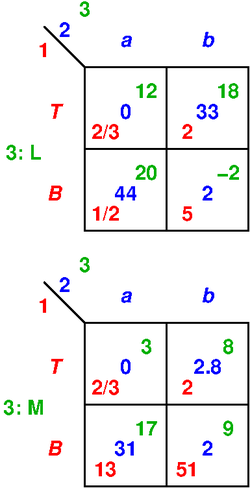

# How to display the strategic form for 3 or more players

Convention is always that a 2-player game has player 1 as
the row player and player 2 as the column player.

Each strategy profile is a cell in the strategic form.

For two players with payoffs `u`, `v` in the cell, we put
`u` into the lower left and `v` into the upper right, as in
this example:

## 3 players

For three players, we keep player 1 for rows and player 2
for columns but player 3 now choosing a *panel*.
The typical picture would be this, where the panels are
arranged horizontally because this keeps the height of the
picture low.
Moreover, the payoffs inside a cell are now staggered and
the only natural order is 1,2,3.
I line with the convention for 2 players we stagger the
payoffs from bottom left to top right, with the center of
each number placed on the diagonal.
Because the numbers have some width this also make good use
of the quadratic shape of the cell.
The meaning of the diagonal stacking follows from the
colours, and is also indicated at the top left (useful?).

### 3 players with vertically stacked panels chosen by player 3

A second possibility is to stack the panels chosen by
player 3:

where a possibly more compact format that omits some
annotations of strategy names is this:

This takes less space on a vertically oriented screen.
Perhaps later one could offer a choice between horizontal
and vertical panels in the settings, or a suitable button.

### 3 players with comma-separated payoffs, vertically stacked panels 

The conventional way of writing payoffs (certainly easier to
typeset, which may be the main reason it is used) is to put
them comma-separated in each cell. 
This is rather natural for 3 players,
but then a square shape of the cell would be a massive waste
of vertical space. Hence, the cells will become rectangles
that are typically much wider than high.
The width could be adapted to the actually need depending
the width of the payoff entries.

The following example uses player colours for the payoffs,
black for the commas, and an annotation (not clear it is
needed) 1,2,3 at the top left.

## 4 players

Clearly, the next systematic step is:
rows player 1, columns player 2, big rows (stacked panels)
for player 3, big columns for player 4:

In the above picture, the player to move is printed with a
colon before the move name (not standard for the strategic
form).
If this is implemented, make the player name *separate*
because it might have its own font.
(Done above for players 1 and 2 but not player 3).

This 4-player scheme can also be adapted for comma-separation.

## Feature: Rotating players

The best arrangement may depend on the number of strategies
per player. 

It would be cool to have some point the option to *choose*
the order of players in display, which would need some
graphical information of what can be done:

- for two players, swap: blue for rows and red for columns

- for three players, not only the horizontal/vertical
  arrangements of the panel choosing player as above, 
  but any of the six permutations of who is where.
  

